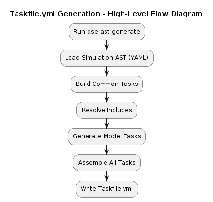

## Synopsis

This document describes the  simulation execution workflow and Taskfile.yml generation used by the Simulation Development Platform (SDP).

## Project folder structure

```text
<project>
├── <project>.dse
├── Makefile
├── <project>.json
├── <project>.yaml
├── simulation.yaml
├── Taskfile.yml
├── .task/
│   └── remote/
│       └── <remote-source>.Taskfile.yml.<hash>.yaml
├── out/
│   ├── cache/
│   ├── downloads/
│   │   ├── <downloaded-files>
│   │   └── models/
│   │       └── <model>/
│   └── sim/
│       ├── data/
│       │   └── simulation.yaml
│       └── model/
│           ├── <model>/
│           │   └── data/
│           └── <model>/
│               ├── data/
│               └── lib/
```

### Source and build files
`<project>.dse` – Defines the simulation configuration, including models, channels, and referenced resources.<br/>
`Makefile` – Contains build commands to generate specifications and prepare the simulation environment.<br/>

### Generated specification files

The following files are generated from `<project>.dse` during the build process:<br/>

`<project>.json` – JSON AST form of the simulation specification<br/>
`<project>.yaml` – YAML AST form of the generated JSON AST<br/>
`simulation.yaml` – Resolved simulation configuration<br/>
`Taskfile.yml` – Task definitions used for build and execution<br/>

### Output directory (out/)

All contents under `out/` are generated and used at build or runtime.<br/>
`out/cache/` – Internal cache for resolution and build steps.<br/>
`out/downloads/` – Downloaded artifacts and external resources (e.g., model archives, binaries).<br/>
`out/sim/` – Simulation runtime directory.<br/>

### Simulation runtime layout

`out/sim/data/` – Contains the generated `simulation.yaml` used at runtime.<br/>
`out/sim/model/` – Runtime directories for each model defined in `<project>.dse`.<br/>
`<model>/data/` – Model-specific data<br/>
`<model>/lib/` – Model libraries or binaries (if required)

### Task runtime metadata

`.task/remote/` – Cached Taskfiles fetched from remote sources during execution.<br/>

## Simulation Flow

<div hidden>
```
@startuml simulation_flow_diagram
title Simulation Flow
:<project>.dse;
:Run DSE Builder container;
:Run Task (task -y -v);
if (Generate simulation validation report?) then (yes)
  :Run DSE Report container;
endif
:Run DSE Simer container;
@enduml
```

</div>


### DSE Builder container
Image: `ghcr.io/boschglobal/dse-builder:latest`

The DSE Builder container is responsible for transforming a `.dse` simulation definition into `simulation.yaml` and `Taskfile.yml`.

It runs the following command-line tools in sequence:

```bash
dse-parse2ast <project>.dse <project>.json
dse-ast convert -input <project>.json -output <project>.yaml
dse-ast resolve -input <project>.yaml
dse-ast generate -input <project>.yaml -output .
```

### DSE Report container
Image: `ghcr.io/boschglobal/dse-report:latest`

The DSE Report container is a containerized simulation validation and reporting tool for Simer-based simulations.

It runs the following command-line tool:

```bash
dse-report path/to/simulation
```

### DSE Simer container
Image: `ghcr.io/boschglobal/dse-simer:latest`

The DSE Simer container provides a containerized runtime environment for executing simulations defined using the DSE framework. It runs simulations based on the resolved simulation.yaml configuration.

It runs the following command-line tool:
```bash
simer path/to/simulation -stepsize 0.0005 -endtime 0.04
```

## Taskfile Generation

This section provides a high-level view of the end-to-end Taskfile generation flow.  
Starting from the simulation AST, the Builder constructs common tasks, resolves includes, generates model-specific tasks, and assembles the final `Taskfile.yml`.

<div hidden>
```
@startuml highlevel_flow_diagram
title Taskfile.yml Generation - High-Level Flow Diagram
:Run dse-ast generate;
:Load Simulation AST (YAML);
:Build Common Tasks;
:Resolve Includes;
:Generate Model Tasks;
:Assemble All Tasks;
:Write Taskfile.yml;
@enduml
```
</div>


